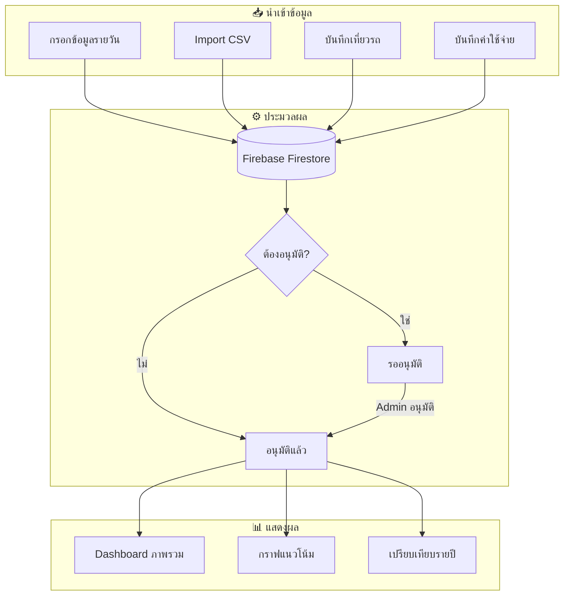

# 📊 Sakulkim Dashboard

ระบบแดชบอร์ดสำหรับจัดการข้อมูลทางการเงินของบริษัทสกุลกิม

🌐 **Live Demo**: [sakulkim-dashboard.vercel.app](https://sakulkim-dashboard.vercel.app)

---

## ✨ ฟีเจอร์หลัก

| ฟีเจอร์ | คำอธิบาย |
|---------|----------|
| 📈 **Dashboard** | แสดงภาพรวมรายได้ ต้นทุน กำไร เปรียบเทียบรายปี |
| 💰 **ค่าใช้จ่าย** | บันทึกและจัดการค่าใช้จ่ายแยกหมวดหมู่ |
| 🚗 **เที่ยวรถ** | บันทึกข้อมูลการขนส่งและรายได้ |
| 📝 **เพิ่มข้อมูล** | กรอกข้อมูลรายรับ-รายจ่ายรายวัน |
| 📥 **นำเข้าข้อมูล** | Import ข้อมูลจากไฟล์ CSV |
| ✅ **อนุมัติ** | ระบบอนุมัติข้อมูลก่อนแสดงผล |
| 👥 **จัดการผู้ใช้** | กำหนดสิทธิ์ Admin/Manager/Staff |

---

## 🔄 Flowchart การทำงาน



---

## 🛠️ เทคโนโลยีที่ใช้

- **Frontend**: HTML, CSS, JavaScript (Vanilla)
- **Backend**: Firebase (Firestore, Authentication)
- **Hosting**: Vercel
- **Charts**: Chart.js

---

## 📱 หน้าจอในระบบ

| หน้า | ไฟล์ | คำอธิบาย |
|------|------|----------|
| Login | `index.html` | เข้าสู่ระบบ |
| Dashboard | `dashboard.html` | ภาพรวมข้อมูล |
| ค่าใช้จ่าย | `expenses.html` | จัดการค่าใช้จ่าย |
| เที่ยวรถ | `vehicle-trips.html` | บันทึกเที่ยวรถ |
| เพิ่มข้อมูล | `data-entry.html` | กรอกข้อมูลรายวัน |
| นำเข้า CSV | `import-data.html` | Import ข้อมูล |
| อนุมัติ | `approvals.html` | อนุมัติรายการ |
| จัดการผู้ใช้ | `users.html` | เพิ่ม/แก้ไขผู้ใช้ |

---

## 🔐 สิทธิ์ผู้ใช้งาน

| หน้า | Admin | Manager | Staff |
|------|:-----:|:-------:|:-----:|
| Dashboard | ✅ | ✅ | ❌ |
| ค่าใช้จ่าย | ✅ | ✅ | ❌ |
| เที่ยวรถ | ✅ | ✅ | ✅ |
| เพิ่มข้อมูล | ✅ | ✅ | ✅ |
| นำเข้า CSV | ✅ | ❌ | ❌ |
| อนุมัติ | ✅ | ✅ | ❌ |
| จัดการผู้ใช้ | ✅ | ❌ | ❌ |

---

## 🚀 วิธีใช้งาน

### 1. เข้าสู่ระบบ
```
URL: https://sakulkim-dashboard.vercel.app
```

### 2. ดู Dashboard
- เลือก **ประเภทข้อมูล** (ทั้งหมด/รายได้/ต้นทุน/กำไร)
- เลือก **ปี** (2568/2569)
- ดู **VS Cards** เปรียบเทียบ 2 ปี

### 3. นำเข้าข้อมูล CSV
- ไปหน้า **นำเข้าข้อมูล**
- เลือกไฟล์ CSV → Preview → นำเข้า


## 📁 โครงสร้างโปรเจค

```
dashboard-kim/
├── css/
│   ├── variables.css    # ตัวแปร CSS
│   ├── base.css         # สไตล์พื้นฐาน
│   ├── components.css   # Components
│   ├── layout.css       # Layout
│   └── responsive.css   # Mobile responsive
├── js/
│   ├── config.js        # Firebase config
│   ├── auth.js          # Authentication
│   ├── app.js           # Main app logic
│   └── charts.js        # Chart functions
├── locales/
│   ├── th.json          # ภาษาไทย
│   └── en.json          # English
└── *.html               # หน้าเว็บต่างๆ
```

---

## 👨‍💻 พัฒนาโดย

ระบบนี้พัฒนาด้วย นาย ภูวรัตถ์นันต์ วงศ์ภูงา

---

*อัพเดทล่าสุด: 24 มกราคม 2569*
